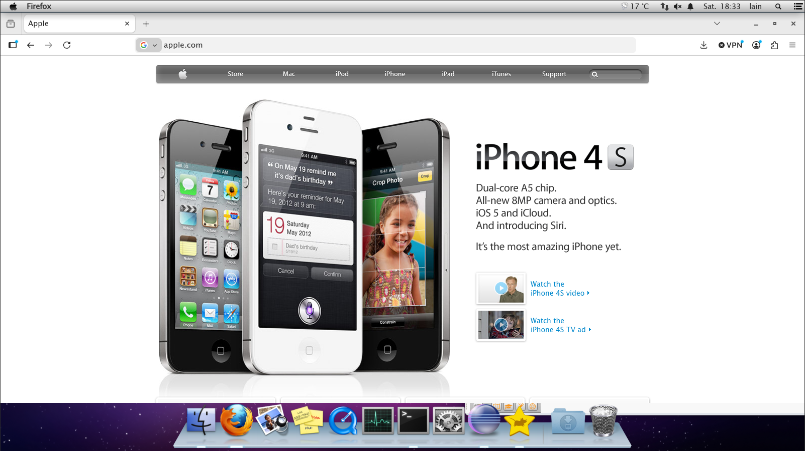
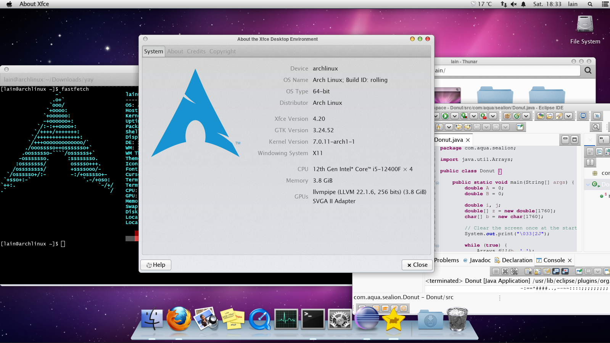

# A blast of the aqua past

Bring the bright, glossy feel of Mac OS X Lion to an XFCE desktop on Arch Linux: the menu bar, the dock, the icons, and a little bit of 2011 magic.


## Get started

From this folder, run:

```sh
./install.sh
```

The installer fetches the theme, icons, fonts, dock, notification applet, and the included XFCE profile. It will ask about your window scale and may ask for your password to install the required Arch packages. When it finishes, log out and back in to enjoy the full effect.

For options such as skipping package installation or choosing another profile, see:

```sh
./install.sh --help
```

## Also check out

OSXfce bundles a few lovely projects. Start with these from [pruefsumme](https://github.com/pruefsumme):

- [OSDockX](https://github.com/pruefsumme/osdockx) — the macOS-inspired dock.
- [OSNotificationX](https://github.com/pruefsumme/OSNotificationX) — the notification applet.

The setup also includes [Lucida Fonts](https://github.com/witt-bit/lucida-fonts), [OSX-Lion for XFCE](https://github.com/orchyn/XFCE), [Mac OS X Lion icons](https://github.com/B00merang-Artwork/Mac-OS-X-Lion), [WhiteSur cursors](https://github.com/vinceliuice/WhiteSur-cursors), and [Vala Panel AppMenu](https://aur.archlinux.org/packages/vala-panel-appmenu).

## A few more looks

Your desktop can keep the aqua details while getting on with real work.





## Independent project

OSXfce is an independent XFCE customization project. It is not affiliated with, endorsed by, or sponsored by Apple Inc. Apple, Mac, and Mac OS X are trademarks of Apple Inc.
